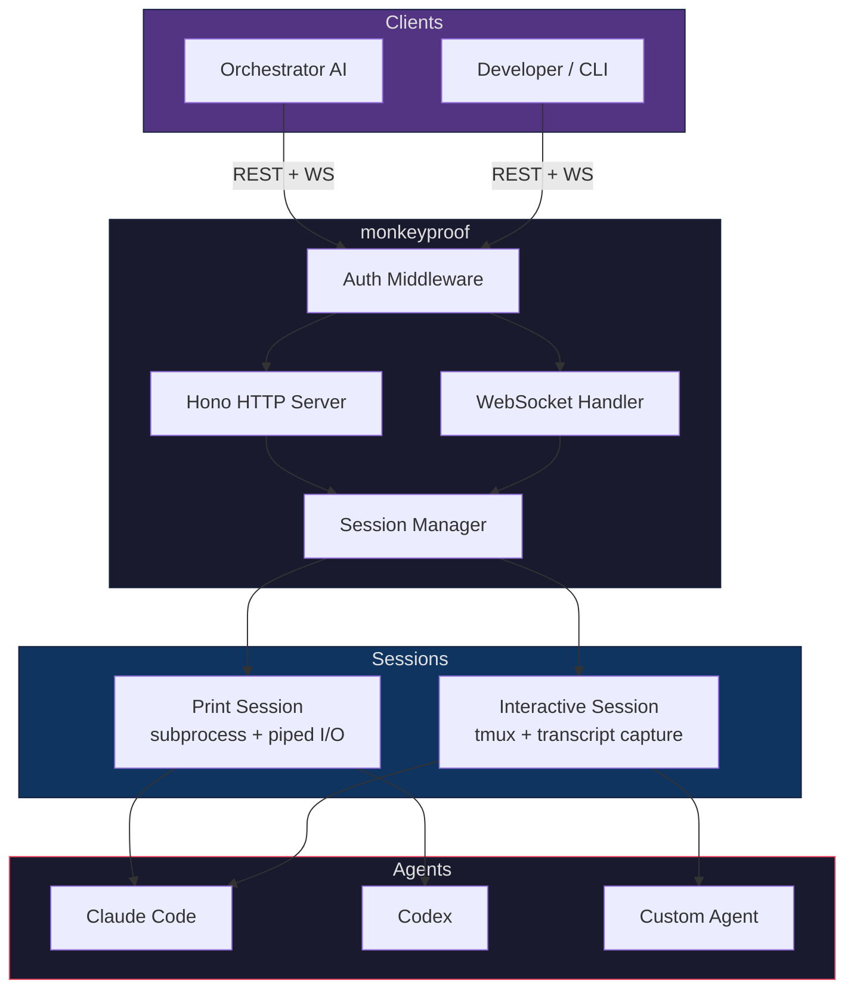

<p align="center">
  <h1 align="center">monkeyproof</h1>
  <p align="center">
    <strong>Remote coding agent orchestration server</strong><br>
    Spawn, stream, and control AI coding sessions via REST + WebSocket.
  </p>
  <p align="center">
    <a href="#quick-start">Quick Start</a> &middot;
    <a href="#api-reference">API</a> &middot;
    <a href="#configuration">Config</a> &middot;
    <a href="#architecture">Architecture</a> &middot;
    <a href="CONTRIBUTING.md">Contributing</a>
  </p>
  <p align="center">
    
    
    
    
  </p>
</p>

---

> Because letting the monkeys ssh into prod is how civilizations end.

Your orchestrator AI lives on a laptop. Your coding agents need beefy hardware and hours of runtime. **monkeyproof** bridges the gap -- a lightweight server that spawns, streams, and manages AI coding sessions on remote machines via a clean REST + WebSocket API.

## Features

- **Two execution modes** -- one-shot `print` (piped subprocess) or persistent `interactive` (tmux-backed)
- **Real-time streaming** -- WebSocket output streaming with automatic catchup on reconnect
- **Agent presets** -- `claude`, `claude-sonnet`, `claude-opus`, `codex`, `codex-auto`, and interactive variants
- **Session lifecycle** -- spawn, monitor, send input, read transcripts, kill, auto-cleanup after TTL
- **Bidirectional I/O** -- send stdin to running agents via REST or WebSocket
- **Transcript capture** -- interactive sessions pipe all output to timestamped Markdown files
- **Bearer auth** -- token-based authentication on all endpoints
- **Zero dependencies** -- just Bun + Hono. No Express, no Socket.IO, no build step
- **Systemd-ready** -- ships with a hardened `monkeyproof.service` unit file

## Quick Start

```bash
git clone https://github.com/rodaddy/monkeyproof.git && cd monkeyproof
bun install
AGENT_WS_TOKEN=your-secret bun run start
```

The server starts on `http://localhost:3200`. Hit `GET /` to verify:

```json
{ "name": "monkeyproof", "version": "0.1.0", "status": "operational" }
```

## Usage

### Spawn a print-mode session

```bash
curl -X POST http://localhost:3200/sessions \
  -H "Authorization: Bearer your-secret" \
  -H "Content-Type: application/json" \
  -d '{
    "task": "Fix the auth bug in src/middleware.ts",
    "cwd": "/home/user/my-project",
    "preset": "claude",
    "maxTurns": 50
  }'
```

### Spawn an interactive (tmux) session

```bash
curl -X POST http://localhost:3200/sessions \
  -H "Authorization: Bearer your-secret" \
  -H "Content-Type: application/json" \
  -d '{
    "task": "Refactor the database layer",
    "cwd": "/home/user/my-project",
    "mode": "interactive",
    "preset": "claude-interactive"
  }'
```

### Stream output via WebSocket

```javascript
const ws = new WebSocket(
  "ws://localhost:3200/sessions/<id>/ws?token=your-secret"
);

ws.onmessage = (e) => {
  const msg = JSON.parse(e.data);
  switch (msg.type) {
    case "catchup":  console.log("Reconnected:", msg.data); break;
    case "stdout":   process.stdout.write(msg.data);        break;
    case "stderr":   process.stderr.write(msg.data);        break;
    case "exit":     console.log(`Done (exit ${msg.code}, ${msg.duration}s)`); break;
    case "killed":   console.log("Session killed");         break;
  }
};

// Send input to the running agent
ws.send(JSON.stringify({ type: "stdin", data: "yes\n" }));
```

### Read transcript (interactive sessions)

```bash
# Full transcript
curl http://localhost:3200/sessions/<id>/transcript \
  -H "Authorization: Bearer your-secret"

# Incremental (from byte offset)
curl "http://localhost:3200/sessions/<id>/transcript?since=4096" \
  -H "Authorization: Bearer your-secret"
```

## API Reference

| Method | Endpoint | Description |
|--------|----------|-------------|
| `GET` | `/` | Health check + server info |
| `GET` | `/health` | Simple health probe (`{ ok: true }`) |
| `POST` | `/sessions` | Spawn a new session (print or interactive) |
| `GET` | `/sessions` | List all sessions |
| `GET` | `/sessions/:id` | Session detail + recent output buffer |
| `DELETE` | `/sessions/:id` | Kill a running session |
| `POST` | `/sessions/:id/input` | Send stdin/keys to a running session |
| `GET` | `/sessions/:id/transcript` | Read transcript file (interactive only) |
| `WS` | `/sessions/:id/ws` | Real-time bidirectional WebSocket stream |

### POST /sessions -- Request Body

| Field | Type | Default | Description |
|-------|------|---------|-------------|
| `task` | `string` | *required* | The prompt/task to send to the coding agent |
| `mode` | `"print" \| "interactive"` | `"print"` | Execution mode |
| `cwd` | `string` | `$HOME` | Working directory for the agent |
| `preset` | `string` | -- | Agent preset name (see below) |
| `command` | `string` | `"claude"` | Custom command (ignored if preset is set) |
| `args` | `string[]` | -- | Custom args (ignored if preset is set) |
| `maxTurns` | `number` | -- | Max conversation turns (Claude agents only) |
| `env` | `object` | -- | Additional environment variables |

### WebSocket Messages

**Server -> Client:**

| Type | Fields | Description |
|------|--------|-------------|
| `catchup` | `id, task, status, exitCode, data` | Sent on connect with buffered output |
| `stdout` | `data` | Standard output chunk |
| `stderr` | `data` | Standard error chunk |
| `exit` | `code, duration` | Process exited normally |
| `killed` | -- | Session was killed via API |

**Client -> Server:**

| Type | Fields | Description |
|------|--------|-------------|
| `stdin` | `data` | Send input to the running agent |

## Agent Presets

| Preset | Command | Mode | Model |
|--------|---------|------|-------|
| `claude` | `claude --print` | print | default |
| `claude-sonnet` | `claude --print` | print | sonnet |
| `claude-opus` | `claude --print` | print | opus |
| `codex` | `codex exec` | print | -- |
| `codex-auto` | `codex exec --full-auto` | print | -- |
| `claude-interactive` | `claude` | interactive | default |
| `claude-interactive-sonnet` | `claude` | interactive | sonnet |
| `claude-interactive-opus` | `claude` | interactive | opus |

## Configuration

All configuration is via environment variables. Bun auto-loads `.env` files.

| Variable | Default | Description |
|----------|---------|-------------|
| `PORT` | `3200` | Server listen port |
| `AGENT_WS_TOKEN` | `monkeyproof-dev` | Bearer token for API auth |
| `MAX_SESSIONS` | `10` | Maximum concurrent sessions |
| `OUTPUT_BUFFER_SIZE` | `2000` | Lines of output buffered per session |
| `SESSION_TTL_MS` | `3600000` | Auto-cleanup delay for exited sessions (ms) |

### Production .env example

```env
PORT=3200
AGENT_WS_TOKEN=change-me-to-something-strong
MAX_SESSIONS=20
OUTPUT_BUFFER_SIZE=5000
SESSION_TTL_MS=7200000
```

## Architecture



### How it works

1. **Client** sends `POST /sessions` with a task and optional preset/config
2. **Session Manager** spawns either a subprocess (print mode) or tmux session (interactive mode)
3. **Output** is buffered in-memory and broadcast to connected WebSocket clients in real-time
4. **Interactive sessions** additionally pipe all output to a transcript file on disk
5. **Clients** can send input via `POST /sessions/:id/input` or through the WebSocket
6. **Exited sessions** are automatically cleaned up after the configured TTL

### Print vs Interactive mode

| | Print | Interactive |
|---|---|---|
| **Backing** | Bun subprocess with piped stdio | tmux session with `pipe-pane` capture |
| **Use case** | One-shot tasks, fire-and-forget | Long-running, multi-turn conversations |
| **Input** | Write to stdin pipe | `tmux send-keys` |
| **Output** | Streamed from stdout/stderr pipes | Polled from tmux pane (2s interval) |
| **Transcript** | No | Yes (`<cwd>/.session/transcript-<date>-<id>.md`) |
| **Survives restart** | No | tmux session persists (server reconnects on restart) |

## Comparison

| | monkeyproof | SSH + nohup | Custom wrapper scripts |
|---|---|---|---|
| Real-time streaming | WebSocket | `tail -f` | varies |
| Session management | Full API | manual PIDs | manual |
| Multi-agent presets | Built-in | none | custom |
| Authentication | Bearer token | SSH keys | varies |
| Transcript capture | Automatic | manual redirect | custom |
| Interactive sessions | tmux-backed | raw terminal | varies |
| Programmatic control | REST + WS | SSH commands | varies |
| Lines of code | ~500 | 0 | grows forever |

## Deployment

### Systemd (included)

```bash
# Copy the service file
sudo cp monkeyproof.service /etc/systemd/system/

# Edit to set your token and paths
sudo systemctl edit monkeyproof

# Enable and start
sudo systemctl enable --now monkeyproof

# Check status
sudo systemctl status monkeyproof
journalctl -u monkeyproof -f
```

### Docker (bring your own)

```dockerfile
FROM oven/bun:latest
WORKDIR /app
COPY package.json bun.lock ./
RUN bun install --frozen-lockfile
COPY . .
EXPOSE 3200
CMD ["bun", "run", "start"]
```

## Requirements

- [Bun](https://bun.sh) v1.0+
- `tmux` (required for interactive mode only)

## License

[MIT](LICENSE) -- go nuts, monkeys.
